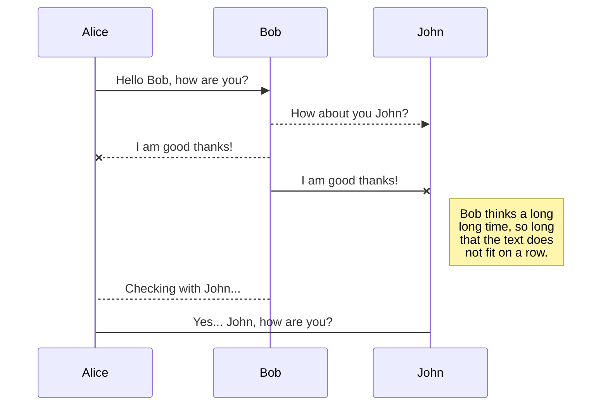
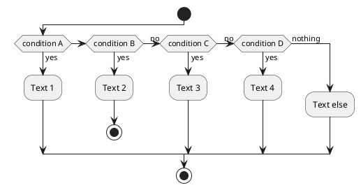

[Hugo](https://gohugo.io/) is a great framework for building websites from markdown documents, but when it comes to diagram integration, you'll soon find that Hugo doesn't support them out of the box.

Well, actually, I must correct myself - Hugo does support Goat diagrams natively!

In this article, I'll explore various ways to render diagrams in Hugo, including PlantUML, Mermaid and Diagon.

The repository of my blog is available [here](https://github.com/JurajBurian/JurajBurian.github.io).

## Goat diagrams
Supported out of the box by Hugo. Here is an example: 
````
```goat
    .--- master branch (development)
   o----o------o----o----o----o----o----o----o
   |    |      |    |    |    |    |    |    |
   |    F1     F2   B1   F3   B2   F4   B3   F5
   |    |      |    |    |    |    |    |    |
   o----o------o----o----o----o----o----o----o
    .--- release/1.1
   o----o------o-------o-------o-------o
   |    |      |       |       |       |
   |    F1     F2      B1`     B2'    B3'
   |    |      |       |       |       |
   o----o------o-------o-------o-------o
    .--- release/1.0
   o----o------o-------o-------o
   |    |      |       |       |
   |    F1     B1''    B2'   ' B3''
   |    |      |       |       |
   o----o------o-------o-------o
```
````
will be rendered as : 
```goat
    .--- master branch (development)
   o----o------o----o----o----o----o----o----o
   |    |      |    |    |    |    |    |    |
   |    F1     F2   B1   F3   B2   F4   B3   F5
   |    |      |    |    |    |    |    |    |
   o----o------o----o----o----o----o----o----o
    .--- release/1.1
   o----o------o-------o-------o-------o
   |    |      |       |       |       |
   |    F1     F2      B1`     B2'    B3'
   |    |      |       |       |       |
   o----o------o-------o-------o-------o
    .--- release/1.0
   o----o------o-------o-------o
   |    |      |       |       |
   |    F1     B1''    B2'   ' B3''
   |    |      |       |       |
   o----o------o-------o-------o
```
Nice and powerful in some cases.

## Mermaid diagrams
This section is based on the [official Hugo documentation](https://gohugo.io/content-management/diagrams/).

Before we start with Mermaid diagrams, let's first understand the structure of Hugo directories and files. Project looks like:
```diagon-tree
~
 layouts
    _default
        _markup
            render-codeblock-*.html
        baseof.html   
 content
    posts
        post1.md
        ...
        postN.md
 themes
    Your theme (PaperMod)
        layouts
        ...
```
To render mermaid diagrams, we need to configure hugo a little bit.<br>
I use `PaperMod` theme and I don't want to change it, so I created directory `layouts/_default` in root of my project.
Under this directory I created directory `_markdown`, In this directory then create a file `render-codeblock-mermaid.html` with the following content:
```html
<pre class="mermaid">
  {{ .Inner | htmlEscape | safeHTML }}
</pre>
{{ .Page.Store.Set "hasMermaid" true }}
```
We've associated the `mermaid` keyword with code blocks ```` ```mermaid ...``` ````. <br>
Then we need to create another file in directory `layouts/_default` named `baseof.html`
I borrowed `baseof.html` from the theme (`PaperMod` in my case) and added in to it next snipped of code: 
```html
... 
<body> ...
{{ if .Store.Get "hasMermaid" }}
<script type="module">
    import mermaid from 'https://cdn.jsdelivr.net/npm/mermaid/dist/mermaid.esm.min.mjs';
    mermaid.initialize({
        startOnLoad: true,
        theme: (localStorage.getItem('pref-theme') === 'dark') ? 'dark' : 'default'
    });
</script>
{{ end }}
...
<body></body>
```
>__Remark:__ Each theme has own `baseof.html`.

Here is an example of `mermaid` diagram:  
````

````
rendered as:


## Plant uml diagrams
The integration of PlantUML diagrams is a bit more complex but follows a similar principle.
[PlantUML](https://plantuml.com) has server that is able to render diagrams on the fly.
The approach is similar as in case of `mermaid`, we create file `render-codeblock-plantuml.html]` in directory `layouts/_markup` with the following content: 
```html
<pre class="plantuml" data-diagram="{{ .Inner }}">
  {{- .Inner -}}
</pre>
{{ .Page.Store.Set "hasPlantUML" true }}
```
and then inside `baseof.html` we add next block: 
```html
{{ if .Store.Get "hasPlantUML" }}
<script type="module">
  import { encode } from 'https://cdn.jsdelivr.net/npm/plantuml-encoder@1.4.0/+esm';
  document.addEventListener('DOMContentLoaded', function() {
    document.querySelectorAll('pre.plantuml').forEach(function(block) {
      const diagramText = block.dataset.diagram;
      const encoded = encode(diagramText);
      const server = "https://www.plantuml.com/plantuml/svg/";

      const img = document.createElement('img');
      img.src = server + encoded;
      img.alt = "PlantUML Diagram";
      img.style.maxWidth = '100%';
      block.parentNode.replaceChild(img, block);
    });
  });
</script>
{{ end }}

```
The code select all blocks with 'pre.plantuml' and replace them with the generated svg image. 

The main disadvantage of this approach is that the SVG image is generated on the fly, which means it's not cached and can be slow to load. Additionally, the service might be temporarily unavailable.

In comparison, Mermaid generates HTML code instead of SVG images, which I find to be a better approach. However, PlantUML offers a more powerful language with additional features.

Example:
````

````
rendered as:


## Diagon
Last possibility I found usable is [diagon](https://github.com/ArthurSonzogni/Diagon).
I created a prototype of integration. I hope yhat I will be able to make it better in the future.<br>
Integration is similar, `math`, `sequence`, `tree`, `table` and `frame` are supported. Under `layyouts/_markup` directory I created files:
`render-codeblock-diagon-xxx.html`, whre xxx ~ is type of diagram. Here is example for `math`:

`render-codeblock-diagon-math.html`
```html
<pre class="diagon-code" data-translator="math">
{{- .Inner -}}
</pre>
{{ .Page.Store.Set "hasDiagon" true }}
```
`baseof.html` is extended with the next code blok:
```html
{{ if .Store.Get "hasDiagon" }}
<script type="module">
    // Import the entire module as an object
    import * as diagonModule from 'https://esm.sh/diagonjs@1.6.1';

    document.addEventListener('DOMContentLoaded', async function() {
        try {
            // Initialize the library. The exact function name might be 'init' or something else.
            const diagon = await diagonModule.init();

            // Process all Diagon code blocks
            document.querySelectorAll('pre.diagon-code').forEach((codeBlock) => {
                const input = codeBlock.textContent;
                const translator = codeBlock.dataset.translator;
                const style = "Unicode";

                let output;
                if (translator === 'math') {
                    output = diagon.translate.math(input, { style: style });
                } else if (translator === 'sequence') {
                    output = diagon.translate.sequence(input, { style: style });
                } else if (translator === 'tree') {
                    output = diagon.translate.tree(input, { style: style });
                } else if (translator === 'table') {
                    output = diagon.translate.table(input, { style: style });
                } else if (translator === 'frame') {
                    output = diagon.translate.frame(input, { style: style });
                } else if (translator === 'dag') {
                    output = diagon.translate.graphDag(input, { style: style });
                } else if (translator === 'grammar') {
                    output = diagon.translate.grammar(input, {
                        style: style
                    });
                }

                if (output) {
                    codeBlock.innerHTML = output;
                }
            });

        } catch (error) {
            console.error('Error loading or using Diagon.js:', error);
        }
    });
</script>
{{ end }}
```
Examples:

````
```diagon-math
[1,2;3,4] * [x;y] = [1*x+2*y; 3*x+4*y]
```
````
is rendered as:
```diagon-math
[1,2;3,4] * [x;y] = [1*x+2*y; 3*x+4*y]
```

````
```diagon-tree
Linux
  Android
  Debian
    Ubuntu
      Lubuntu
      Kubuntu
      Xubuntu
      Xubuntu
    Mint
  Centos
  Fedora
```
````
is rendered as:
```diagon-tree
Linux
  Android
  Debian
    Ubuntu
      Lubuntu
      Kubuntu
      Xubuntu
      Xubuntu
    Mint
  Centos
  Fedora
```

````
```diagon-sequence
2) Actor 2 -> Actor 3: message 1
1) Actor 1 -> Actor 2: message 2

Actor 1:
Actor 2: 1<2
Actor 3:
```
````
is rendered as:
```diagon-sequence
2) Actor 2 -> Actor 3: message 1
1) Actor 1 -> Actor 2: message 2

Actor 1:
Actor 2: 1<2
Actor 3:
```

```diagon-table
Column 1,Column 2,Column 3
C++,Web,Assembly
Javascript,CSS,HTML
```
````
```diagon-frame
{
  // let calculate employees having the smallest salary per department as lateral join with SQL API
  getDepartmentDF.createTempView("ds")
  getEmployeeDF.createTempView("es")

  val result = spark
    .sql(
      """
      |SELECT ds.id, ds.budget, es.name, ds.department, es.salary
      |FROM ds
      |INNER JOIN LATERAL (
      |  SELECT *
      |  FROM es
      |  WHERE ds.id = es.dept_id and ds.budget < es.salary
      |  ORDER BY salary ASC
      |  LIMIT 3
      |) AS es""".stripMargin
    )

  println("-------------------------------------------------------")
  println("Lateral join result as SQL:")
  result.explain(true)
  result.show()
}
```
````
is rendered as:
```diagon-frame
{
  // let calculate employees having the smallest salary per department as lateral join with SQL API
  getDepartmentDF.createTempView("ds")
  getEmployeeDF.createTempView("es")

  val result = spark
    .sql(
      """
      |SELECT ds.id, ds.budget, es.name, ds.department, es.salary
      |FROM ds
      |INNER JOIN LATERAL (
      |  SELECT *
      |  FROM es
      |  WHERE ds.id = es.dept_id and ds.budget < es.salary
      |  ORDER BY salary ASC
      |  LIMIT 3
      |) AS es""".stripMargin
    )

  println("-------------------------------------------------------")
  println("Lateral join result as SQL:")
  result.explain(true)
  result.show()
}
```

